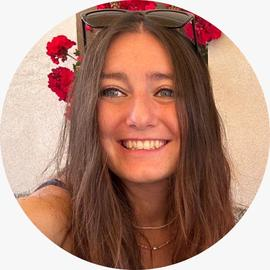
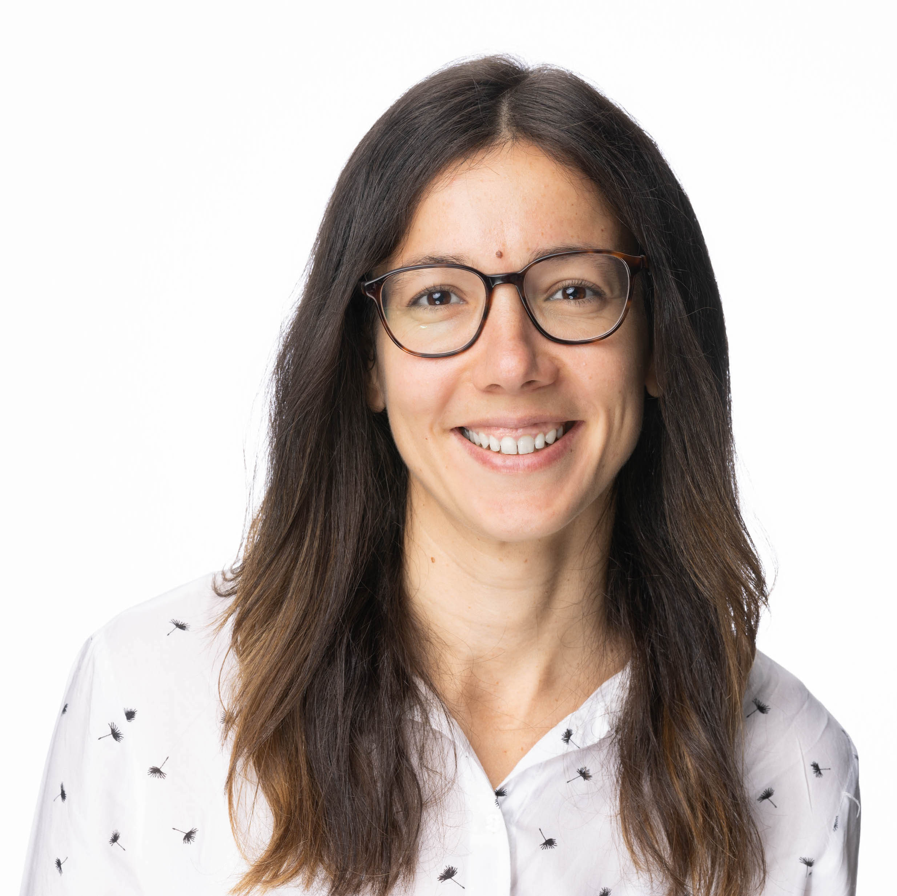

# Overview

The one-week intensive summer school **Biological Data Science** teaches advanced computational analyses of modern molecular data types in biology and biomedicine, including single cell and spatial omics. It comprises lectures covering underlying theory and concepts, practical hands-on exercises, and informal discussion sessions. Lecture topics include modern biotechnologies for quantitative measurements, statistical analysis, visualisation, and computational tools. Hands-on exercises are looking at state-of-the-art datasets, using the R / Bioconductor environment. At the end of the course, you should be better able to design, implement and interpret analyses on your own (multi-)omic, single and/or spatial data, adapt and combine different tools, and make informed and scientifically sound choices about analysis strategies.

# Faculty and Teaching Assistants

| | | |
| :--: | :--: | :--: |
| {width=200}  **Vince Carey**  Harvard Medical School | {width=200}  **Helena Crowell**  CNAG Barcelona |  {width=200}  **Laurent Gatto**  UC Louvain |
|  |  |  |
| {width=200}  **Wolfgang Huber**  EMBL|  {width=200}  **Johannes Rainer**  Eurac Research | {width=200}  **Davide Risso**  University of Padova |
|  |  |  |
| {width=200}  **Charlotte Soneson**  Friedrich Miescher Institute for Biomedical Research | {width=200}  **Ilaria Billato**  University of Padova | {width=200}  **Hugo Gruson**  EMBL |
| | | |
| {width=100}  **Daria Lazic**  EMBL |

::: {.column-margin}
Organized in collaboration with    

:::